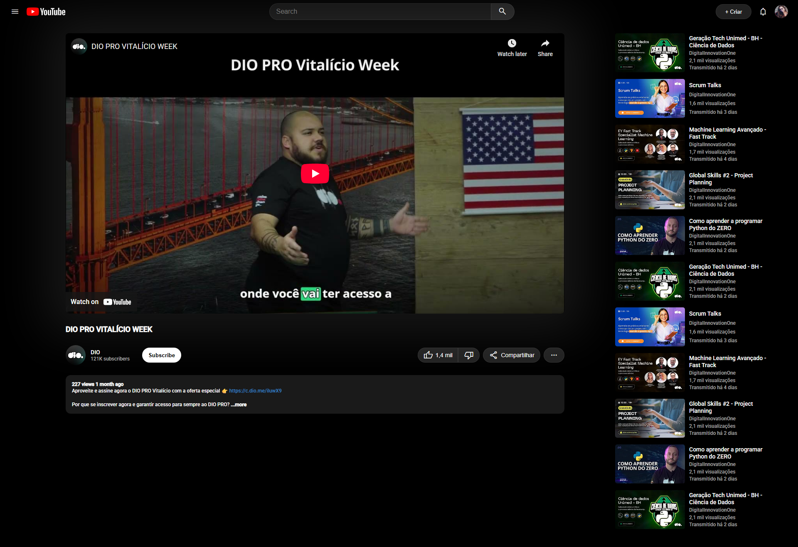

# projeto-youtube-clone

Projeto realizado pelo Bootcamp Santander 2025 - Front-end.

Desenvolvi a página tentando clonar a estética do youtube e utilizando somente flexbox para o layout do site.

Essa escolha do flexbox se deu em razão de ser o conteúdo do módulo do projeto.

Utilizei media queries para dar responsabilidade ao site, tentando ao máximo aproximar o projeto da aparência do Youtube.

## Translate

Santander 2025 - Front-end Bootcamp Project

I developed this page attempting to clone YouTube's aesthetic, utilizing only Flexbox for the site's layout.

This choice of flexbox was made because it was the content of the project module.

I used media queries to make the site responsive, aiming to bring the project's appearance as close as possible to YouTube's.

## Access Here

<a href="https://www.youtube.com/watch?v=7iqVdZtM10E" target=_blank> Visit the model I based on</a>

<a href="https://mttoledo.github.io/project-youtube-clone/" target=_blank> Visit my project</a>

## Screenshots

  

